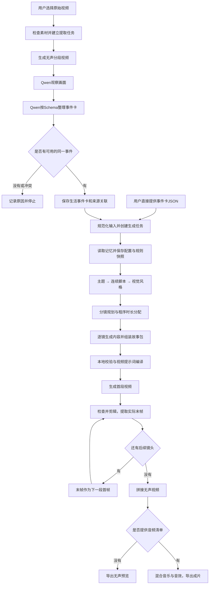
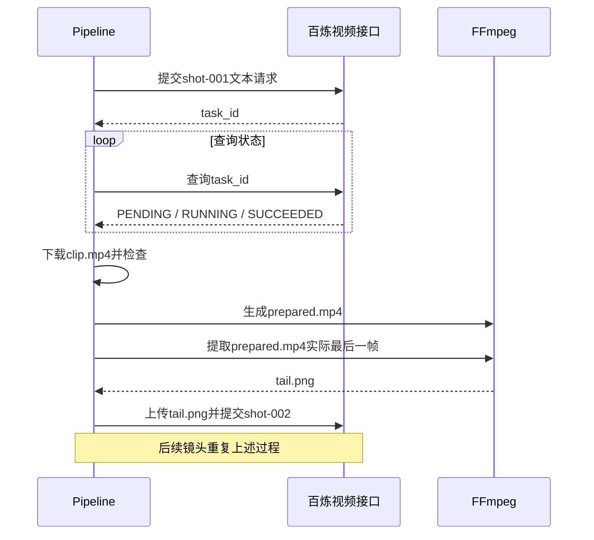

# 白日梦想家 Agent：思路、流程、文件结构与代码实现分析

分析日期：2026-09-29。分析对象是当前工作区中的 `daydreamer-agent`，并包含与它相连的 `网页交互端` 和 `deploy/web`。本文依据实际源码、当前配置、一个已有任务的归档及本地测试编写；模型名称与限制指本项目当前实现，不代表对云平台最新能力的核验。

**这个 Agent 的核心是：把生活视频转换成可追溯的事件卡，再把事件卡转换成连续的第一人称幻想故事，最后通过逐段生成、末帧续接和本地剪辑输出视频。**

它采用明确阶段的工作流：程序决定执行顺序、保存状态和调用工具；模型负责理解画面和创作内容。源码中没有由大模型自由选择工具、持续自主规划的通用 Agent 循环，也没有多 Agent 协作运行机制。

## 1. 先看整体设计

### 1.1 三类工作分别由谁完成

| 工作 | 实现者 | 典型内容 |
|---|---|---|
| 理解与创作 | Qwen | 观察视频、整理事件卡、生成主题、脚本、画风和分镜 |
| 视频生成 | 百炼视频接口，当前默认 MiniMax H3 | 第一段文生视频，后续段使用上一段末帧生成 |
| 确定性处理 | Python 标准库、FFmpeg、FFprobe、SQLite | 参数检查、时长分配、字段组装、状态保存、恢复、剪辑、混音、导出 |

这样拆分的意义是：模型处理开放性的内容问题；编号、文件路径、来源关系、时长总和等可计算的信息交给程序，减少模型重复输出造成的错漏。

### 1.2 全流程图



图中的每个模型阶段都有对应的本地记录。恢复任务时先找记录，再决定是否继续调用模型。

### 1.3 当前默认设置

依据：[默认配置](<../config/default.toml>)、[模型能力表](<../src/daydreamer_agent/providers/video_models.py>)。

| 项目 | 当前值 | 实际含义 |
|---|---|---|
| 故事模型 | `qwen3.8-max` | 主题、脚本、画风、分镜共用该模型 |
| 视频理解模型 | `qwen3.8-max` | 使用带视频输入的调用方式 |
| 视频模型 | `MiniMax/MiniMax-H3` | 首段与续接段相同 |
| 连续方式 | `frame_chain` | 镜头必须按顺序生成 |
| 总时长 | 根据内容决定，上限 60 秒 | 不强制拉满 60 秒 |
| 单镜时长 | 4–15 秒整数 | 本项目 H3 约束；旧 Wan 路径为 3–15 秒 |
| 画幅、分辨率 | `16:9`、`768P` | 当前 H3 合成链只开放 768P |
| 创作随机性 | `seed_only`、temperature=1.0 | 每阶段只生成一个方案 |
| 故事请求超时 | 600 秒 | 网络超时不会直接启动整轮重写 |
| 创作重开上限 | 2 次 | 初始一轮加重开，最多三轮 |
| 视频超时重提 | 300 秒，最多 1 次/镜 | 超时后再次查询确认才重提 |
| 音频 | 自动服务未接入 | 一键运行默认导出无声预览 |
| 内容审查 | 无独立故事复核、无媒体内容检查 | 保留本地格式、引用和技术检查 |

## 2. 文件结构：先知道各层在哪里

下面是职责结构，省略虚拟环境、历史任务和媒体素材的具体文件。

```text
Bold Maker/
├── daydreamer-agent/
│   ├── daydreamer.cmd              Windows启动入口
│   ├── daydreamer.ps1              文件选择、输入类型判断、调用项目Python
│   ├── daydreamer.py               将src加入模块路径，调用cli.main
│   ├── pyproject.toml              Python 3.12项目；第三方Python依赖为空
│   ├── config/default.toml         模型、时长、存储、重试等默认配置
│   ├── prompts/event_extraction.md 视频理解后整理事件卡的规则
│   ├── schemas/life_event_card.schema.json
│   ├── resources/
│   │   ├── event-card/             事件卡格式参考
│   │   └── daydreamer-style-transfer/
│   │       ├── SKILL.md            幻想转译的创作规则
│   │       └── references/         输出字段规范、风格选择和示例
│   ├── src/daydreamer_agent/
│   │   ├── cli.py                 命令解析与各入口分流
│   │   ├── application/
│   │   │   ├── settings.py        配置、凭据与参数检查
│   │   │   ├── video_workflow.py  提取任务与生成任务的持久关联
│   │   │   ├── pipeline.py        故事、视频、恢复、拼接的主编排
│   │   │   └── delivery.py        交付目录与可读分镜导出
│   │   ├── domain/
│   │   │   ├── events.py          事件卡输入适配与规范化
│   │   │   ├── continuity.py      镜头起止状态与连续性结构校验
│   │   │   └── errors.py          格式、模型、提交不明等错误类型
│   │   ├── event_extraction/
│   │   │   ├── media.py           原视频检查、均分、压缩和去音轨
│   │   │   ├── pipeline.py        观察→结构化→合并→导出
│   │   │   └── validation.py      Schema、时间、来源和引用校验
│   │   ├── story/
│   │   │   ├── generator.py       创作规则装载、阶段指令、旧流程
│   │   │   ├── creativity.py      基础seed与阶段seed
│   │   │   ├── seeded.py          当前单方案创作和有上限的重开
│   │   │   ├── assembly.py        分镜规划、逐镜生成、程序组装
│   │   │   ├── timing.py          单镜整数时长与总时长分配
│   │   │   ├── validation.py      故事包字段与引用检查
│   │   │   └── diversity.py       共用请求/修正函数，以及旧多候选实现
│   │   ├── prompts/video_compiler.py  将故事与分镜编译为视频请求
│   │   ├── providers/
│   │   │   ├── qwen.py            文本创作接口适配
│   │   │   ├── qwen_vision.py     多模态观察与事件卡结构化接口
│   │   │   ├── wan.py             当前BailianVideo，兼容旧WanVideo名称
│   │   │   ├── video_models.py    各视频模型约束
│   │   │   ├── temporary_upload.py 续接PNG临时上传
│   │   │   ├── http.py            HTTP、脱敏、查询重试、文件下载
│   │   │   └── audio.py           本地音乐与音效清单适配
│   │   ├── media/ffmpeg.py        视频检查、剪辑、末帧、拼接、混音
│   │   ├── memory/repository.py   读取世界记忆、过滤画风、保存增量草案
│   │   ├── storage/
│   │   │   ├── files.py           原子JSON写入、文件与对象指纹
│   │   │   └── jobs_sqlite.py     JSON任务真值、SQLite索引、文件锁
│   │   └── web/
│   │       ├── server.py          上传、鉴权、状态和播放API
│   │       ├── store.py           网页任务队列与会话数据库
│   │       └── worker.py          队列消费者，复用命令行核心流程
│   ├── deploy/                    Linux服务、反向代理、部署打包
│   │   └── web/                   部署版播放器配置及保留的上传页面
│   ├── data/extractions/          视频理解的任务与检查点
│   ├── data/runs/                 幻想生成的任务与检查点
│   ├── data/memory/               可选的世界记忆
│   ├── outputs/                   面向使用者的交付文件
│   ├── tests/                     本地自动化测试
│   └── docs/                      设计与说明文档
└── 网页交互端/
    ├── index.html                 角色与云朵界面
    ├── app.js                     加载、云朵展开、播放与收起
    ├── cloud-shape.js             云朵形状支持
    ├── styles.css                 页面视觉样式
    ├── config.js                  本地演示：直接播放指定MP4
    └── server.cjs                 本地静态服务
```

阅读代码时，先看 `cli.py → application/video_workflow.py → application/pipeline.py`，再按所关注的阶段进入具体模块，最容易建立整体认识。

## 3. 第一步：接收输入并选择执行路径

代码：[Windows入口](<../daydreamer.ps1>)、[Python入口](<../daydreamer.py>)、[命令分流](<../src/daydreamer_agent/cli.py>)。

`daydreamer.ps1` 默认打开文件选择窗口，并根据扩展名判断：JSON 作为事件卡，其他输入作为视频。`-Extract` 表示只提取事件卡；`-Run` 表示恢复已有任务。取消文件选择直接退出，不创建任务。

核心判断摘录：

```powershell
$taskInputFlag = if ($Extract -or [IO.Path]::GetExtension($taskEventPath) -ine '.json') { '--video' } else { '--events' }
```

`daydreamer.py` 把当前项目的 `src` 加入 Python 模块路径，然后执行 `cli.main()`。`cli.parser()` 定义命令，`run_command()` 负责真正分流。

| 命令 | 从哪里开始 | 到哪里结束 |
|---|---|---|
| `extract` | 原视频或已有提取任务 | 事件卡导出 |
| `plan` | 事件卡或已有生成任务 | 故事包与每镜视频请求 |
| `run` | 原视频、事件卡或任务编号 | 无声预览/成片，或可恢复的停止状态 |
| `render` | 已有故事和视频请求 | 所有镜头生成完成 |
| `compose` | 已成功的镜头 | 无声预览或带本地音频的成片 |
| `import-story` | 事件卡和修改后的故事 | 建立独立新任务并编译请求 |
| `retry-shot` / `regenerate-shot` | 已有镜头 | 准备下一次尝试，之后仍需render |
| `attach-task` | 提交结果未知的镜头 | 补录已在平台核实的任务编号 |
| `doctor` / `status` / `demo` | 配置、任务或离线样例 | 环境信息、状态或离线演示 |

**产物：**生成或提取任务编号，以及创建时的配置和输入快照。

## 4. 第二步：把原视频转成生活事件卡

代码：[提取流程](<../src/daydreamer_agent/event_extraction/pipeline.py>)、[素材处理](<../src/daydreamer_agent/event_extraction/media.py>)、[视觉模型适配](<../src/daydreamer_agent/providers/qwen_vision.py>)、[事件卡校验](<../src/daydreamer_agent/event_extraction/validation.py>)。

### 4.1 建立素材身份

`EventExtraction.create()` 使用 FFprobe 检查视频，要求至少 2 秒、存在有效视频画面，默认最多 1800 秒。它计算文件 SHA-256，以其前 24 位构造 `material_id`，保存原始路径、尺寸、时长和文件指纹。

同时保存当时的事件卡 Schema 和提示词。后续恢复读取快照，不直接替换成新修改的提取规则。

### 4.2 制作模型可接收的无声副本

`chunk_ranges()` 先计算 `ceil(总时长 / chunk_seconds)`，再均分原视频。它不是每 60 秒机械截断。例如 61 秒视频会分成约 30.5 秒的两段，避免尾段只有 1 秒。

`prepare_chunk()` 将每段压缩为最长边不超过 640 像素的 H.264 视频，设为 12fps，删除音轨、字幕及元数据，单段文件控制在 6,750,000 字节以内。`extraction.fps=2` 是发给视觉接口的采样设置，与副本编码帧率 12fps 是两个概念。

原文件不被改写；时间线不加速、不删黑场，以便把模型结果映射回原视频。

### 4.3 分成“观察”和“结构化”两次模型调用

当前默认提供者实现了 `observe()`，因此每段走两步：

1. **看画面：**`QwenVision.observe()` 接收 Base64 编码的视频，返回 `status、issues、observations`。`observations` 是带时间信息的中文观察文本。
2. **整理结构：**`EventExtraction.stage()` 把观察文本交给文本调用，通过严格 JSON Schema 输出生活事件卡。

这样做的直接原因写在源码注释中：多模态调用不能可靠地使用嵌套事件卡的严格 Schema，所以先保存观察，再用文本接口结构化。不能把当前实现简化成“一次视觉调用直接得到最终事件卡”。

事件卡的七个顶层字段为：

| 字段 | 用途 |
|---|---|
| `basic_info` | 程序提供的事件ID、标题、场景、时间范围 |
| `event_description` | 概述、按顺序排列的可见动作及来源区间 |
| `key_frames` | 关键画面的文字描述、估计秒数、参考重点 |
| `audio_info` | 当前提取链固定为空数组 |
| `details_to_preserve` | 值得在幻想转译中保留的细节与依据 |
| `selection_info` | 筛选状态和未完成去重的声明 |
| `memory_links` | 当前提取链不关联历史记忆，相关数组为空 |

`key_frames.image_uri` 为 `null`。这里的“关键画面”是文字记录，不是提取出来的图片；后面视频续接产生的 `tail.png` 属于另一个阶段。

### 4.4 本地检查、合并和停止条件

本地检查包括：字段是否齐全、事件ID是否正确、动作顺序是否递增、来源是否属于当前素材、动作区间是否在视频范围内、关键帧时间是否严格小于视频时长。

对多段视频，程序先给时间戳加上分段起点，再在存在多张有效分段卡时调用一次合并阶段。合并只能使用已有画面ID和允许的来源区间。

`no_event` 表示没有可用事件，不导出空卡；`needs_resolution` 表示多个独立事件或信息冲突，停止后续生成。格式修正有次数上限，旧协议迁移另有兼容分支，不能理解成无限重试。

**产物：**`data/extractions/<提取编号>/card.json`，以及 `outputs/event-cards/<提取编号>/` 下的事件卡、素材引用表和提取记录。

## 5. 第三步：把事件卡接入生成任务

代码：[任务桥接](<../src/daydreamer_agent/application/video_workflow.py>)、[输入适配](<../src/daydreamer_agent/domain/events.py>)、[任务初始化](<../src/daydreamer_agent/cli.py>)、[记忆读取](<../src/daydreamer_agent/memory/repository.py>)。

### 5.1 一个用户流程，内部两个核心任务

从视频启动时，`run_video_workflow()` 建立提取任务，完成后再建立生成任务，并保存 `generation_run_id`。生成任务保存反向关联 `input/source-extraction.json`。

```text
全流程/提取任务编号
    ├── 原视频与事件卡
    └── generation_run_id
             └── 生成任务：故事、镜头、剪辑、交付
```

关联在付费创作调用之前保存。恢复全流程编号时，程序找到原来的生成任务，不重新创建一套故事和视频。

桥接还比较事件卡摘要指纹，阻止把修改后的卡片悄悄接入已有生成任务。

### 5.2 统一多种事件卡输入

`normalize()` 接受简化卡、完整七项卡、卡片数组，或带 `event_cards` 的对象。`adapt_card()` 保留原完整字段，同时补充内部统一字段：

```text
event_id、summary、ordered_actions、details、source_refs、sound_clues、unknowns
```

因此，后续故事模块不需要为每种输入文件格式写一条流程。故事阶段只读事件卡文字，不再次打开其中引用的视频或图片。

### 5.3 参数与记忆

在当前初始化代码中，制作参数的填充顺序为：显式命令行覆盖 → 输入事件中的参数 → 项目 production/video 默认值 → `run` 专用 workflow 默认值。当前 production/video 的相关默认值为空，所以通常最终使用 workflow 的自动时长、16:9、768P。

记忆来自 `--memory` 或 `data/memory/<world_id>/current.json`。`narrative_memory()` 递归删除 `visual_style、palette、lighting、materials、prompt、shots` 等制作字段，减少历史画风影响新故事；这只是字段过滤，不是自动理解和彻底清理所有旧风格描述。

**产物：**生成任务的 `input/normalized.json、original.json、config.json、memory.json、skill.json`，开启随机创作时另有 `creativity.json`。

## 6. 第四步：加载创作规则，确定主题、脚本和画风

代码：[阶段指令与规则装载](<../src/daydreamer_agent/story/generator.py>)、[当前创作主流程](<../src/daydreamer_agent/story/seeded.py>)、[Qwen请求适配](<../src/daydreamer_agent/providers/qwen.py>)。

### 6.1 Skill在这个项目中如何起作用

`load_skill()` 读取项目内 `resources/daydreamer-style-transfer/` 的三个文件：`SKILL.md`、`references/input-output-schema.md`、`references/style-selection.md`，并保存到任务的 `input/skill.json`。

这些文件作为**创作规则文本**进入系统提示词；它们不是单独运行的服务，也不是一个额外 Agent。当前任务使用的是项目内快照，不是自动读取用户全局技能目录。

规则要求幻想仍能看出真实动作来源；全片围绕一个行动目标；第一人称眼睛视点；明确非写实；先有剧情再选画风；只规划音乐和音效，不依靠旁白或对白。

### 6.2 三个模型阶段

| 阶段 | 输入 | 模型输出 | 设计作用 |
|---|---|---|---|
| `theme` | 事件卡、记忆、制作约束 | 主题、行动目标、幻想规则、边界、现实映射 | 明确这段经历到底在做什么 |
| `script` | 上一步主题与原输入 | `beat`数组：行动、可见后果、结束状态 | 保持动作和因果连续 |
| `visual_style` | 主题、完整脚本、原输入 | 媒介、造型空间、色彩、材质、光线、运动表现等 | 让画风服务已经确定的剧情 |

每个阶段的上游结果通过 `upstream` 传给下一个阶段。正常情况下只生成一个方案，不生成候选池。

例如“骑车向前并转弯”在事实层仍然是骑行动作；主题阶段可以将其转译成“追赶信使”，脚本阶段安排“靠近→避障→转弯跟随”，最后才决定使用剪纸或风格化动画。这里的示例用于说明职责，并非声称代码固定生成这种故事。

### 6.3 请求协议与随机种子

`Qwen.generate()` 将规则放入 system 消息，将输入与上游结果编码成 user JSON。请求显式关闭 `enable_thinking`，并要求输出 JSON；前三阶段使用 `json_object`，分镜规划和单镜调用使用独立严格 Schema。

程序不读取模型内部推理。本文所说的“Agent思路”，指可观察的设计逻辑、阶段划分和控制流程。

`creativity.initialize()` 创建基础 seed，`stage_seed()` 根据基础 seed、阶段名等派生阶段 seed。修正请求在该阶段 seed 上加一。保存 seed 有助于记录和复用请求条件，不能保证云端模型重新调用时逐字完全相同。

## 7. 第五步：规划分镜，并由程序分配时长

代码：[分镜组装](<../src/daydreamer_agent/story/assembly.py>)、[时长分配](<../src/daydreamer_agent/story/timing.py>)。

### 7.1 先锁定创作结果

`generate_assembly()` 将已经完成的 `theme、script、visual_style` 复制到 `locked`。之后不要求模型再输出这些字段，避免在生成分镜时重写已确定的故事。

规划调用只新增：镜头与 `beat_ids` 的对应关系、建议时长、`action_range`、声音方案、假设、使用的记忆ID和记忆增量草案。

分镜必须覆盖所有 beat，并按脚本顺序推进；一个 beat 可以跨多个镜头，一个镜头也可以覆盖多个相邻 beat。

### 7.2 时长不是完全信任模型算术

`fit_plan_timing()` 按模型限制分配整数秒数：

1. 有固定总时长时，将它作为目标。
2. 没有固定时长而有上限时，参考模型建议；缺失建议按 6 秒参与总长估计，限制总长不超过上限，不自动拉满上限。
3. 检查镜头数能否容纳目标时长：H3需满足 `4 × 镜头数 ≤ 总长 ≤ 15 × 镜头数`。
4. 在可行条件下按建议比例分配整数时长，每镜从最小时长开始逐秒分配，最大不超过15秒。
5. 若镜头数根本不可行，反馈规划阶段调整镜头边界；不直接删除剧情。

例：H3 固定总长12秒，4个镜头至少需要16秒，因此不能单靠缩短每镜解决，必须重新规划为最多3镜。

程序把模型建议和实际分配分别保存到 `plan-timing.json`，保留调整依据。原始模型响应不被覆盖。

## 8. 第六步：逐镜生成内容，再组装完整故事包

代码：[generate_assembly / build_shot / assemble](<../src/daydreamer_agent/story/assembly.py>)、[故事校验](<../src/daydreamer_agent/story/validation.py>)。

每次单镜请求只提供必要上下文：锁定的主题与画风、全片行动摘要、当前beat、本镜动作范围、前镜结束状态、声音规划和制作约束。规划调用最多8192 token，单镜最多4096 token。

模型负责当前镜头的四项提示词、声音文字、结束状态和衔接描述。第一镜另外生成开始状态；第二镜开始不再生成自己的起点。

关键源码摘录：

```python
start = deepcopy(previous_end if previous_end is not None else fragment["start"])
```

即：**后一镜的开始状态直接复制前一镜的结束状态。** 六项状态是 `camera_position、view_direction、camera_motion、layout、object_states、lighting`，分别记录机位、视线、运动、布局、物件/行动状态和光线。

`build_shot()` 还负责补齐：

- `shot-001` 这样的镜头编号。
- `beat_ids`、事件ID及输入中已有的素材引用。
- 已分配好的整数时长和时长依据。
- 从六项结构化状态得到的 `start_state / end_state` 文字。
- 必要时在画面内容前添加固定第一人称声明，另存补充记录。

最后 `assemble()` 把锁定字段、规划和镜头拼成故事包，`validate_story()` 检查字段、引用、beat覆盖、时长、连续状态及记忆版本。

最终 `story/result.json` 的主要结构为：

```text
schema_version、status、source_event_ids、memory_basis、assumptions
theme、script、visual_style、audio_plan、shots
checks=[]、issues=[]、world_delta_draft
```

这些检查证明结构符合项目契约，不证明画面效果、动作合理性或故事趣味已通过人工/模型评价。

## 9. 第七步：把分镜编译成视频模型请求

代码：[compile_shot](<../src/daydreamer_agent/prompts/video_compiler.py>)、[Pipeline.finish_story](<../src/daydreamer_agent/application/pipeline.py>)。

视频模型不是只收到分镜中的“画面内容”一句话。`compile_shot()` 组装完整上下文，包含：第一人称约束、持续行动目标、前段已发生的进展、本段剧情、起止范围、世界规则、空间与支撑关系、统一风格、稳定特征、连续状态，以及四项分镜提示词。

它特别要求“不要重演前段，也不要提前演完后段”，用于降低每段视频重新开场的问题。

请求结构如下，为说明结构的示例：

```json
{
  "model": "MiniMax/MiniMax-H3",
  "input": {"prompt": "编译后的完整视频提示词"},
  "parameters": {"duration": 8, "ratio": "16:9", "resolution": "768P"}
}
```

H3路径不会附带Wan专属的 `audio` 和 `prompt_extend` 参数。提示词超过7000字符时停止，不自动截断。

`finish_story()` 保存故事指纹和各视频请求指纹。`render()` 会在提交第一段之前检查所有请求，尽量避免先花费生成第一段，再发现后续分镜参数无效。

**产物：**`shots/<shot_id>/video_request.json`、任务中的 `story_digest / request_digests`，以及只保存未提交的记忆增量草案。

## 10. 第八步：提交视频任务，并逐段续接

代码：[Pipeline.render / submit_attempt / prepare_boundary](<../src/daydreamer_agent/application/pipeline.py>)、[BailianVideo](<../src/daydreamer_agent/providers/wan.py>)、[临时上传](<../src/daydreamer_agent/providers/temporary_upload.py>)。

### 10.1 为什么视频阶段必须串行

首段是文生视频。后段需要前段实际结束画面，因此必须等待前段成功、下载、剪辑、提取末帧后才能提交。当前 `render()` 本身就是串行循环，不是读取并发参数启动多个并行任务。



### 10.2 提交之前先记状态

`submit_attempt()` 先保存请求及前驱关系，再把镜头标记为 `submitting`，然后调用远端接口。拿到 `task_id` 后才保存为 `submitted`。

如果提交发生网络中断，程序可能不知道云端是否已收到请求。此时使用 `submission_unknown`，不直接再发一次；用户核对平台后可通过 `attach-task` 补录原任务编号。

### 10.3 真正用于续接的图片是什么

`accept_downloaded_clip()` 检查原片，`prepare_boundary()` 把原片处理成 `prepared.mp4`，再由 `extract_tail()` 解码末尾并保留实际最后一帧。

这不是从“计划8秒”推算第240帧，也不是直接拿未剪辑原片的末帧。这样才能让下一段首帧对应最终拼接中前一段实际结束的位置。

H3请求中的PNG会先经 `temporary_upload.upload_png()` 临时上传，视频接口通过OSS引用读取；包含OSS资源时HTTP适配层增加相应解析请求头。

前后镜头依赖保存为：

```python
return {
    "shot_id": state["shot_id"],
    "attempt": state["attempt"],
    "prepared_sha256": state["prepared_sha256"],
    "tail_sha256": state["tail_sha256"],
}
```

因此，重做前镜会影响后镜。程序会检查前驱版本，并在符合重做条件时使后续旧结果失效，防止新前段与旧后段混拼。

**连续性的实际能力边界：**程序保证起止文字状态的传递、首帧来源和依赖版本一致；它不能保证生成模型完全保持人物、运动速度、空间或物体外观。交付记录明确写入 `continuity_verified: false`。

## 11. 第九步：技术检查、剪辑、拼接与声音

代码：[Media](<../src/daydreamer_agent/media/ffmpeg.py>)、[音频清单适配](<../src/daydreamer_agent/providers/audio.py>)、[Pipeline.compose](<../src/daydreamer_agent/application/pipeline.py>)。

### 11.1 原片与剪辑结果使用不同容差

`check_clip(..., source=True)` 允许模型原片短0.3秒；超长容差为目标时长的15%与1秒中较小者。剪辑片段和最终成片的时长容差则为正负0.3秒。

除此之外还检查：有效视频轨、帧率、尺寸、画幅误差、分辨率以及实际解码。该检查不识别画面里发生了什么。

`prepare_clip()` 统一尺寸、像素比例、30fps和H.264/yuv420p编码，删除原音轨，最多补0.3秒尾帧并按目标时长裁切。对于16:9、768P，本地尺寸计算得到1366×768。

如果远端已成功且原片已下载，只是本地技术检查失败，恢复时会尝试复用原片；保存过指纹的文件一旦改变则拒绝直接复用，不自动付费重生成。

### 11.2 拼接

`Media.compose()` 按镜头顺序准备片段，写 `concat.txt`，使用FFmpeg concat拼成 `composition/silent.mp4`。当前转场方式是顺序硬切，故事中的 `transition_to_next` 是内容衔接描述，不会自动变成淡入淡出等视频特效。

### 11.3 声音

没有音频清单时输出无声预览。有清单时，`stage_audio()` 检查本地文件、时间位置和音量，复制进任务目录并记录指纹；背景音乐循环铺满，音效按 `at_seconds` 延迟加入，最后混音、限制峰值并编码AAC。

`audio_plan` 只是创作出的声音文字方案，不会自动触发音乐或音效生成。`contains_speech: false` 是清单声明，程序没有自动人声识别功能。

## 12. 第十步：导出与归档

代码：[export_delivery](<../src/daydreamer_agent/application/delivery.py>)、[run_generation](<../src/daydreamer_agent/cli.py>)。

导出前检查视频路径位于任务目录、文件存在、指纹一致、结果没有被标为失效。之后生成面向使用者的交付文件：

```text
outputs/<生成任务编号>/
├── 连续续接_无声预览.mp4       默认无声模式
├── 成片.mp4                  使用音频清单时
├── 完整故事与分镜.json
├── 故事与分镜.md
├── 本轮运行记录.json
├── 创作随机种子.json          seed_only任务
├── 创作重开记录.json          存在创作尝试记录时
├── 生活事件卡.json            从视频全流程启动时
└── 素材提取关联.json          从视频全流程启动时
```

前两个视频文件按本次输出模式生成，并非每次都同时存在。

一个容易困惑的状态差异是：无声预览返回 `preview_ready`，但生成任务的 `job.json` 通常仍是 `awaiting_audio`，同时含 `preview` 路径。这表示预览已经可用，正式带音频版本仍未完成；网页层会把可用预览转换为自己的 `ready` 状态。

## 13. 恢复、修正与重试：三种不同机制

### 13.1 文本阶段的格式修正

代码：[共用request函数](<../src/daydreamer_agent/story/diversity.py>)。

`request()` 先计算当前规则、上下文、seed、temperature和可选Schema等组成的 `basis` 指纹。已有检查点且指纹一致时直接校验并复用；不一致则停止，要求建立新任务。

新请求先保存模型响应，再本地检查。结构不合格时把字段和错误原因传回当前阶段，最多修正一次；修正只涉及当前阶段，不要求整包重写。

网络错误另存到 `errors/`，不算作内容格式修正。被服务明确过滤或拒绝的响应也不会进入自动创作重开循环。

### 13.2 整轮创作重开

代码：[generate_seeded_story](<../src/daydreamer_agent/story/seeded.py>)。

只有 `CreativeRepairExhausted` 会触发整轮重开：记录失败阶段，生成新的基础seed，从主题重新开始，复用已完成的事件卡。默认最多重开2次。

`story/creation-attempts.json` 保存次数和状态，恢复不会清零。重开目录为 `story/seeded-restart-01/` 等；原轮保留在 `story/seeded/`。

### 13.3 视频超时重提

代码：[Pipeline.render](<../src/daydreamer_agent/application/pipeline.py>)。

镜头处于PENDING/RUNNING且距离提交超过300秒时，再查询一次；仍未完成，且没有超过重提上限，才创建下一次尝试。默认每镜最多自动重提1次。

旧远端任务不会被自动取消，仍可能完成和计费，最终只采用新尝试。明确失败、提交结果未知、查询网络错误、下载失败不会触发这一超时重提规则。

| 情况 | 程序行为 | 恢复时复用什么 |
|---|---|---|
| 已保存的主题/脚本/分镜 | 校验指纹并复用 | 阶段结果，不重复请求 |
| 文本网络超时 | 保存错误并停止 | 已完成阶段；未收到结果的阶段可能再次调用 |
| 当前阶段格式修正耗尽 | 在预算内换seed重开 | 原事件卡、原任务编号、失败记录 |
| 视频已提交且运行中 | 查询原task_id | 原远端任务 |
| 视频提交结果未知 | 停止自动提交 | 原提交记录，待补录task_id |
| 原片下载后技术检查失败 | 重新检查原片 | 原task_id、原尝试和未变化文件 |
| 指纹不一致 | 停止混用 | 不擅自接纳修改内容 |
| 修改已有故事 | 使用import-story建新任务 | 原任务留档 |

### 13.4 核心存储怎么实现

代码：[JobStore](<../src/daydreamer_agent/storage/jobs_sqlite.py>)、[文件操作](<../src/daydreamer_agent/storage/files.py>)。

核心生成任务以JSON为恢复依据，SQLite是状态索引。`write_json()` 先写同目录临时文件，flush和fsync后用 `os.replace()` 替换目标；任务锁在Windows使用 `msvcrt`，Linux使用 `fcntl`，避免两个进程同时推进同一任务。

每次镜头尝试分别保存 `attempts/<次数>/task.json`，当前状态另存 `shots/<shot_id>/state.json`；`logs/events.jsonl` 记录状态变化。

需要区分：网页层 `web/store.py` 的队列和会话以 `web.sqlite3` 为持久存储，不适用“SQLite只是可重建索引”的描述。

## 14. 一次任务的文件如何对应流程

```text
data/extractions/<提取编号>/
├── job.json                         提取状态、生成子任务关联
├── input/normalized.json             原素材信息与理解配置
├── input/config.json                 项目配置快照
├── input/rules.json                  提取提示词和Schema快照
├── media/part-001.mp4                 无声理解副本
├── media/part-001.json                副本指纹与起止时间
├── stages/part-001/
│   ├── observation-v4-1.json         视觉观察响应
│   ├── structured-v4/               严格Schema结构化响应与检查点
│   └── result.json                  本段最终结果
├── stages/merge/                     多张有效分段卡的合并记录
├── observations.json                 各段状态摘要
└── card.json                         最终生活事件卡

data/runs/<生成编号>/
├── job.json                         核心任务状态、故事/请求指纹
├── input/                           原始与规范化输入、配置、记忆、规则、seed
├── story/
│   ├── creation-attempts.json        重开次数及各轮状态
│   ├── seeded/
│   │   ├── theme.json
│   │   ├── script.json
│   │   ├── visual_style.json
│   │   ├── responses/               各阶段模型响应和用量
│   │   ├── errors/                  有网络错误时产生
│   │   └── assembly-v1/
│   │       ├── plan.json             分镜规划检查点
│   │       ├── plan-timing.json      建议与实际时长
│   │       ├── shot-001.json         单镜检查点
│   │       ├── responses/            规划与单镜原响应
│   │       ├── result.json           本轮组装故事
│   │       └── assembly-record.json  锁定字段指纹及程序补充记录
│   ├── seeded-restart-01/           如发生重开，与seeded采用同类结构
│   ├── result.json                  经流程接受的最终故事包
│   └── world_delta_draft.json        committed=false的记忆草案
├── shots/shot-001/
│   ├── video_request.json           编译请求
│   ├── state.json                   当前镜头状态
│   └── attempts/1/
│       ├── task.json                此尝试状态与task_id
│       ├── video_request.json       此尝试请求、前驱与首帧来源
│       ├── clip.mp4                 下载原片
│       ├── prepared.mp4             实际用于续接和拼接的片段
│       └── tail.png                 实际剪辑末帧
├── audio/                           有音频清单时的本地素材与记录
├── composition/                     时间线、拼接片段、silent.mp4与预览清单
├── final/video.mp4                  正式带音频输出
├── manifest.json                    正式成片清单
└── logs/events.jsonl                状态事件记录
```

目录按执行阶段产生，未运行到的阶段不会凭空出现对应文件。

## 15. 网页和手机入口如何接入Agent

代码：[Web API](<../src/daydreamer_agent/web/server.py>)、[网页任务存储](<../src/daydreamer_agent/web/store.py>)、[Worker](<../src/daydreamer_agent/web/worker.py>)、[部署版播放配置](<../deploy/web/config.js>)、[播放界面](<../../web/app.js>)。

### 15.1 上传和排队

`POST /api/jobs` 接收原始视频请求体，要求合法类型、明确Content-Length和 `Idempotency-Key`。上限是250MiB；重复使用同一个请求键时返回已有任务，防止上传重试创建重复任务。

文件先写 `.part`，完成后替换为正式素材，并将网页任务状态从 `uploading` 改成 `queued`。队列最多容纳10个 uploading/queued/processing 状态任务。

这只是按请求键去重，不是按视频内容指纹去重；同一视频换新请求键仍可以建立新任务。

### 15.2 Worker复用同一套生成逻辑

`worker.main()` 持有独占worker锁，从SQLite队列取任务。`process()` 在首次模型调用前保存提取任务编号，然后直接构造CLI参数执行：

```text
run --run <已保存的提取任务编号> --wait 3600
```

网页入口没有复制另一套模型流程。完成后把交付视频路径写回网页任务；未完成转为 `paused`，异常转为 `failed`。服务重启时可有限次数地把processing任务重新入队，继续原编号。

### 15.3 播放端只拿结果

部署版 `resolveVideo()` 轮询任务状态，ready时返回 `video_url`；播放组件负责加载、云朵展开、播放、结束收起。播放结束可调用 `/played` 记录已看过。

| API | 作用 | 当前权限行为 |
|---|---|---|
| `POST /api/session` | 用连接码建立浏览器会话 | 连接码校验；当前只允许一个绑定会话记录 |
| `POST /api/jobs` | 上传并创建生成任务 | 浏览器会话或专用上传凭据 |
| `GET /api/jobs` | 列出任务库 | 浏览器会话 |
| `GET /api/jobs/<id>` | 查询已知任务 | 当前公开可读 |
| `POST /api/jobs/<id>/resume` | 恢复原任务 | 浏览器会话 |
| `GET /api/videos/next` | 获取可播放任务 | 当前公开可读 |
| `GET /api/jobs/<id>/video` | 视频文件，支持Range | 当前公开可读 |
| `POST /api/jobs/<id>/played` | 标记已播放 | 当前无需登录，POST仍检查来源 |

实际有三种不同ID：网页队列job id → 提取/全流程run id → 生成run id。排查问题时应沿关联逐层定位，不能混用。

### 15.4 当前界面的两个实际特例

1. 工作区的 `网页交互端/config.js` 直接指定本地MP4，因此本地点击云朵主要是播放演示，不会自动创建生成任务。
2. `deploy/web/config.js` 当前设置了非空 `pinnedJob`，优先级高于URL中的job参数和自动选择下一条逻辑。因此当前部署配置会固定请求一个指定任务；清空这个配置后，才会恢复正常选择。本文未改动它。

此外，服务器将 `/upload`、`/upload.html`、`/connect`、`/connect.html` 重定向到首页。虽然上传页面代码仍保留，当前路由并未把它们作为直接访问入口。是否有手机原生上传器、以及线上是否运行本地这一版本，本次没有外部验证。

## 16. 用一个已有任务串起整个过程

本地实际任务：20260925T161139-7f0a44c0ed（本地记录未入库），故事名“石墩航道的信使追击”。依据该任务的 `input/normalized.json` 和 `story/result.json`：

| 镜头 | 时长 | 对应脚本 |
|---|---:|---|
| shot-001 | 9秒 | beat_1 |
| shot-002 | 7秒 | beat_1、beat_2 |
| shot-003 | 8秒 | beat_2 |
| shot-004 | 6秒 | beat_3 |
| shot-005 | 8秒 | beat_3 |
| 合计 | 38秒 | 覆盖3个beat |

该任务配置为自动时长、上限60秒、16:9、768P、H3、frame_chain。这说明“自动时长”会停在38秒，也说明beat和镜头不是一一对应。

阅读这次执行记录，可依次打开：

1. `input/source-extraction.json`：找到它来自哪个视频提取任务。
2. `story/seeded/theme.json → script.json → visual_style.json`：查看三个已确定的创作阶段。
3. `story/seeded/assembly-v1/plan-timing.json`：比较模型建议与实际镜头时长。
4. `story/seeded/assembly-v1/shot-001.json`：查看单镜生成结果。
5. `story/result.json`：查看程序组装后的完整故事。
6. `shots/shot-001/video_request.json`：查看实际编译出的提示词。
7. `shots/shot-002/state.json`：查看第二镜的前驱、尝试次数及文件指纹。
8. `composition/preview-manifest.json`：查看参与拼接的镜头版本与输出记录。

该任务 `job.json` 当前为 `awaiting_audio` 且存在 `preview` 字段，符合“无声预览完成、等待音频”的实现。这里只用于展示归档与数据关系，本次未重新生成或重新评价这部影片的画面质量。

## 17. 哪些是当前能力，哪些是旧代码或规划

| 容易产生的理解 | 源码显示的实际情况 |
|---|---|
| 文件名wan.py，所以默认还是Wan | 类已是BailianVideo，默认配置为H3，WanVideo保留别名兼容 |
| creativity.py里有历史相似度，所以每次会去重 | 当前initialize写seed_only；默认链不执行历史相似度审阅 |
| diversity.py都是废弃代码 | 旧多候选流程不走默认链，但request、ready、validate_candidates仍被当前链复用 |
| 默认最后让模型重写完整故事JSON | 当前assembly由程序保留主题/脚本/画风并组装；无creativity快照的旧路径仍有整包生成 |
| 设置review_before_video=true就会弹出审批 | 当前执行取决于plan/render/run入口，源码没有以该字段实现交互审批 |
| generation_concurrency可直接调高并行 | 当前render循环串行，没有使用该字段建立并发调度 |
| 音频方案已经意味着生成了音乐 | 当前只实现本地音频清单接入与混音 |
| 写入world_delta_draft就更新了长期记忆 | 只保存committed=false草案，没有自动提交当前世界记忆 |
| 引用关键帧就代表故事模型看过图片 | 故事模型读事件卡文字；视觉理解在前面的专门阶段 |
| 技术检查通过就说明剧情和画面连贯 | 仅验证结构、引用与文件技术属性，未执行媒体语义检查 |

还有两处应按代码而不是旧示例理解：

- README保留了720P、3–15秒和Wan等早期表述；当前默认H3路径必须使用768P、4–15秒。
- `run --wait` 在当前CLI允许0–86400秒，默认3600秒；`render --wait` 允许0–3600秒，默认1800秒。它们是本次视频等待预算，与单镜300秒重提阈值、文本600秒请求超时分别计算。

**快照的边界也要讲清楚：**配置、输入、技能文本以及提取规则有快照，但不是把整个Python实现打包进任务。规划和编译等代码更新仍可能影响恢复；检查点basis不一致时会停止，而非保证任意代码版本都可以无缝续跑。

## 18. 如果要继续开发，应修改哪里

以下是基于当前结构的维护建议，不代表本次已实施代码改动。

| 想改变的行为 | 优先查看/修改 | 为什么 |
|---|---|---|
| 生活事件卡字段 | schemas/life_event_card.schema.json、event_extraction/validation.py、prompts/event_extraction.md | 模型输出协议和本地验证必须一致 |
| 视频理解方式 | qwen_vision.py、event_extraction/pipeline.py | 负责观察与结构化的两段调用 |
| 幻想转译规则 | resources/daydreamer-style-transfer、story/generator.py | 前者是规则文本，后者是阶段任务 |
| 分镜细节和上下文 | story/assembly.py | 决定每镜输入、Schema和程序补齐字段 |
| 时长策略 | config/default.toml、story/timing.py | 约束和确定性分配分离 |
| 视频提示词 | prompts/video_compiler.py | 统一编译每镜实际提交文本 |
| 视频模型切换 | providers/video_models.py、wan.py、temporary_upload.py、media/ffmpeg.py | 能力、参数、首帧和成片规格需同步 |
| 自动音乐/音效生成 | providers/audio.py、Pipeline.compose周边 | 当前只有本地素材入口，可在此引入生成适配 |
| 正式长期记忆 | memory/repository.py及新提交流程 | 需要增量确认、版本管理和冲突处理 |
| 网页播放选择 | deploy/web/config.js、web/store.py | 一个控制前端选片，一个控制后端任务排序 |
| 手机上传或队列 | web/server.py、web/store.py、web/worker.py | 上传、状态持久化、生成执行分别负责 |

建议优先统一README和当前模型限制；标明哪些配置目前未被消费；为默认链与旧兼容链建立更清楚的命名。若之后要评价视觉连续性，应另建明确的内容评估阶段，不能把当前技术校验名称改成“内容已通过”。

## 19. 本次验证与分析范围

2026-09-29在项目虚拟环境执行了已有测试：

```powershell
.\.venv\Scripts\python.exe -X utf8 -m unittest discover -s tests -v
```

结果：**191项测试，30.370秒，全部通过，未报告跳过。** 日志见本次测试记录（本地记录未入库）。测试使用本地文件、模拟提供者以及本地媒体/Web接口，未调用真实模型生成新内容。

| 测试文件类别 | 覆盖的主要问题 |
|---|---|
| test_event_extraction、test_full_event_card、test_video_workflow | 事件卡结构、视频理解检查点、提取与生成关联 |
| test_seeded、test_creativity、test_story_timing | 阶段seed、单方案创作、重开、分镜组装与时长 |
| test_pipeline、test_frame_chain、test_timeout_retry | 视频编排、末帧依赖、恢复、超时重提 |
| test_minimax、test_clip_tolerance、test_media | H3参数、原片容差、剪辑与合成 |
| test_workflow、test_web_service | 一键入口、导出、网页队列、权限、恢复与播放 |

本次新增分析文档与验证记录，未修改Agent业务逻辑、默认配置或既有任务。没有检查线上部署是否与本地一致，也没有评估生成视频的美术质量或实际云端接口可用性。

配套阅读：[核心代码逐段导读](<../docs/Agent核心代码逐段导读.md>)。该文件按调用顺序收录真实源码摘录、行号和阅读说明，可与本文对照。
